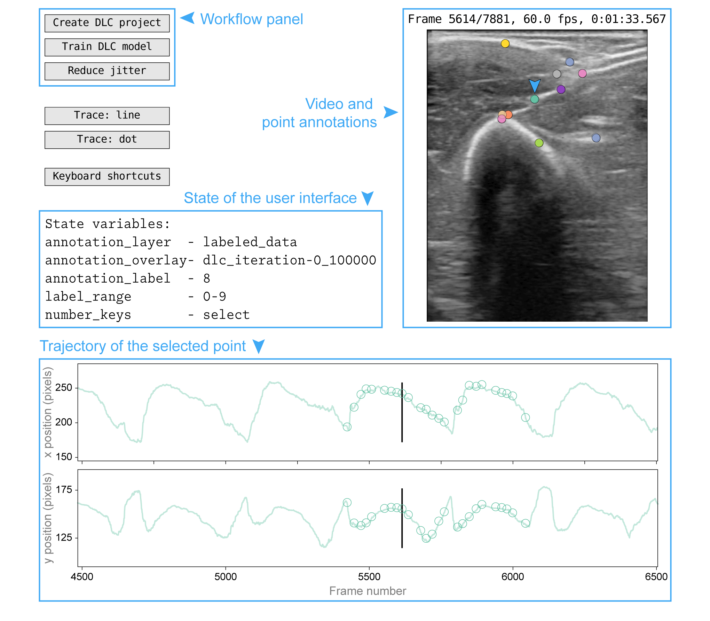
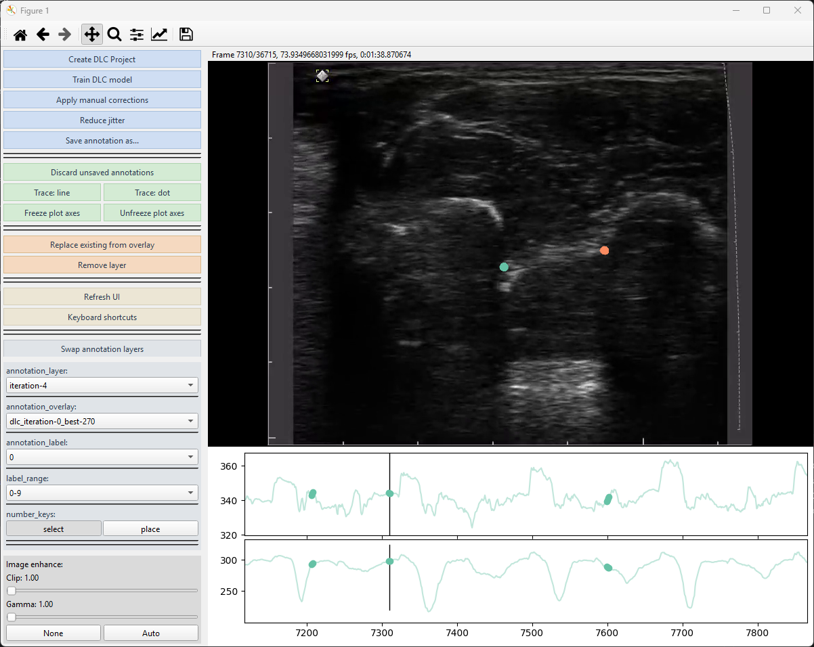

## DUSTrack GUI

### Four-panel architecture (figure from the paper)

**DUSTrack's graphical user interface, as published in the paper.**
The interface has four panels: the **workflow panel** (top left)
provides controls for creating DLC projects, training models, and
applying jitter-reduction post-processing; the **video and point
annotations** panel (right) shows the ultrasound video frame with
current point annotations (the selected point is marked with an
arrow); the **interface state panel** (middle left) displays active
variables, including the current annotation layer and selected point;
and the **trajectory of the selected point** panel (bottom) shows the
x and y coordinates over time. The interface can display two
annotation "layers" simultaneously — in this example, the
`labeled_data` layer appears as open circles in the trajectory plot,
while the `dlc_iteration-0_100000` layer appears as a translucent
continuous trace. Blue text, arrows, and boxes have been added to
highlight the interface features and are not part of the actual
interface.

### Current GUI (1.1.0)

**The four-panel architecture above is unchanged in current releases,
but the contents within each panel have evolved since the paper.**
Specifically:

- **Workflow panel**: now organized into four task-flow groups
  separated by horizontal lines, with a pastel per-group palette
  (powder blue → mint → apricot → silver):
  - **Workflow**: Create DLC project · Train DLC model · Apply manual
    corrections · Reduce jitter · Save annotation as...
  - **Display**: Trace: line / Trace: dot · Freeze/Unfreeze plot
    axes · Refresh UI · Keyboard shortcuts — and an **EnhanceWidget**
    with two sliders (CLAHE clip, Gamma) plus a `None | Auto` button
    row that replaces the old "Toggle enhance" single-button
    affordance.
  - **Niche** (layer-mutating affordances): Decimate annotations ·
    Discard unsaved annotations · Replace existing from overlay ·
    Remove layer.
  - **Swap layers** (foreground ↔ overlay, positioned directly above
    the statevars widget it manipulates).
- **Interface state panel**: promoted from a static text overlay to
  an interactive Qt widget. Each state variable is now its own row
  with a control matched to the variable's type — dropdowns for
  `annotation_layer` / `annotation_overlay`, toggle buttons for
  `number_keys`, and so on. Long values (e.g.
  `dlc_iteration-3_250000`) no longer elide.
- **Video panel**: visually unchanged, but the rendering backend
  swapped to a Qt-native `QGraphicsView` + `QPixmapItem`
  (`fast_render=True`, on by default). Wheel-zoom and middle-button
  pan/reset land on the image pane; the trajectory pane below
  continues to render through matplotlib for now (Qt-native traces
  ship in 1.2.0).
- **Trajectory panel**: unchanged in look. Press `r` while hovering
  over a trajectory plot to reset the time axis to the full video
  range and autoscale y to the visible data; press `alt+r` to reset
  both axes to the data extent. While hovering over the image pane,
  `r` instead resets the image zoom/pan.

For a complete list of keyboard shortcuts and mouse controls, see
{doc}`keyboardshortcuts` — or open the **Keyboard shortcuts** button
in the Display group to display the same cheatsheet live, grouped
by section (Annotation / Frame navigation / Layer-label /
LK-interpolate / View / File / Other).
